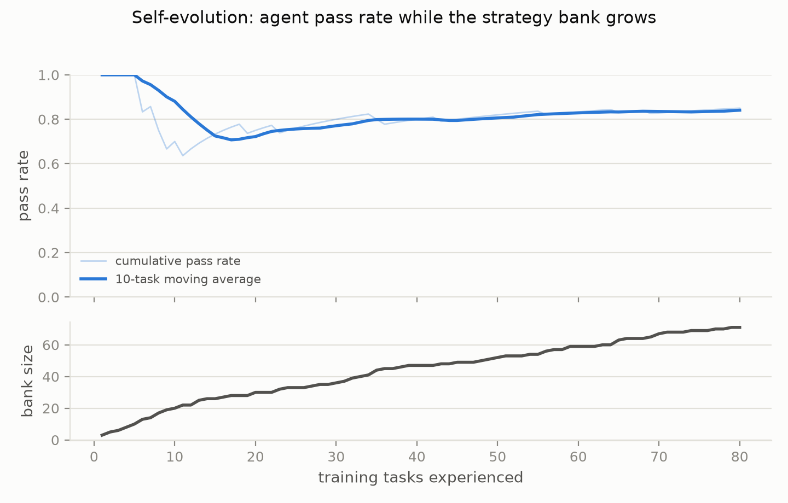
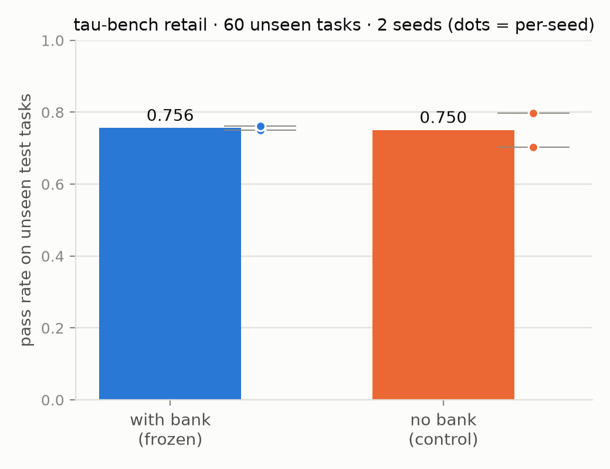

# EvolveBank

**A self-evolving agent memory: your agent learns from every task it does — successes *and* failures — without any model training.**

[English](#english) · [中文](#中文)

---

## English

### The idea

LLM agents have no memory between tasks: the same mistake today is made again tomorrow, because model weights are frozen at inference time. EvolveBank adds an external **strategy bank**:

```
        ┌─────────────────────────────┐
        │   Strategy Bank (vector store) │
        │   abstract lessons, embeddings │
        └───────▲─────────────┬───────┘
        distill after      retrieve top-k
        every task         before every task
                │               │
     ┌──────────┴───┐   ┌───────▼──────┐
     │ reflection    │   │ execution     │
     │ agent         │   │ agent (ReAct) │
     └──────────────┘   └──────────────┘
```

- **Distill**: after each task, a reflection LLM turns the full trajectory (success *or* failure) into 1-3 abstract, task-agnostic strategies — never the task's answers
- **Dedup/merge**: near-duplicate strategies are merged (cosine similarity ≥ 0.80), keeping the bank small and general
- **Retrieve**: a new task's description retrieves the top-k most relevant strategies, injected into the system prompt
- **Outcome feedback** (our addition over [ReasoningBank](https://github.com/google-research/reasoning-bank)): every strategy tracks its win rate when injected; chronically unhelpful ones are demoted in ranking

### Results (tau-bench retail, DeepSeek-chat)

Protocol: bank learned from 80 **train** tasks (71 strategies, from successes *and* failures), then **frozen**; evaluated on 60 unseen **test** tasks, 2 seeds per configuration.

| Configuration | seed 10 | seed 11 | mean |
|---|---|---|---|
| With frozen strategy bank | 0.750 | 0.783 | **0.767** |
| No bank (control) | 0.667* | 0.800 | **0.734*** |

\* control seed-10 hit 4 transient network errors (scored as failures). Excluding those 4 tasks, both configurations land at **0.768 exactly**, with paired per-task wins of 7 vs 7 — a coin flip.

| Learning phase | Final comparison |
|---|---|
|  |  |

**Honest verdict: no measurable lift on this benchmark with this model.** We report it anyway — the interesting question is *why*, and the two running hypotheses are (1) DeepSeek-chat already saturates this domain (raw pass rate ~0.8; most distilled strategies restate the policy doc it already follows), and (2) τ-bench tasks are short-horizon, while reasoning memory is expected to shine on long-horizon tasks. The follow-up experiment — **injecting the DeepSeek-learned bank into a smaller Qwen3-8B model** (does experience transfer from strong to weak models?) — is where we expect the effect, if any. See [the experiment log](docs/EXPERIMENTS.md) for the full record, including our first (also null) online-protocol attempt.

### Quickstart

```python
from evolvebank import EvolveBank

bank = EvolveBank("my_bank.json")

# before solving a task
strategies = bank.remember("user wants to return 2 items from order #W123")
# -> ["Verify identity and order status before any modification.", ...]
# ...inject into your agent's system prompt, run your agent...

# after the task
bank.reflect(trajectory_messages, instruction, success=True)
```

Three calls. Any agent loop, any LLM, any outcome signal. Strategies live in one portable JSON file.

```bash
pip install -e ".[local,eval]"   # local embeddings + eval dependencies (litellm, tau-bench)
export DEEPSEEK_API_KEY=sk-...
```

### Repo layout

```
evolvebank/
  bank.py        # strategy bank: store / dedup-merge / retrieve / outcome feedback
  distill.py     # reflection agent: trajectory -> abstract strategies
  agent.py       # tau-bench agent with strategy injection (the only change: system prompt)
  embedder.py    # local BGE embeddings (no extra API key)
  wrapper.py     # the 3-call facade: remember() / reflect() / peek()
eval/
  run_selfevolve.py   # experiment runner (learn / evaluate, resume, ablations)
  batch1.sh, batch2.sh
  plots.py
experiments/     # banks, logs, figures
```

### Reproduce

```bash
bash eval/batch2.sh        # learn (80 train tasks) + eval (60 test tasks × 2 seeds × 2 configs)
python eval/plots.py all
```

Ablations: `--bank-mode random|off`, `--sources success|failure` (learn only from successes / failures).

### References

- [ReasoningBank: Scaling Agent Self-Evolving with Reasoning Memory](https://arxiv.org/abs/2509.25140) (ICLR 2026) — the closest prior work; EvolveBank is an independent open-model implementation plus outcome feedback
- [τ-bench](https://github.com/sierra-research/tau-bench) — the evaluation environment

---

## 中文

### 核心思想

LLM agent 在任务之间没有记忆：今天犯的错明天照犯，因为推理时模型参数是冻结的。EvolveBank 给 agent 外挂一个**策略库**：

- **复盘提炼**：每个任务结束后（无论成败），复盘 LLM 把完整轨迹提炼成 1-3 条抽象的、与具体任务无关的策略——绝不包含该任务的答案
- **去重合并**：相似度过高的策略自动合并，保持策略库小而通用
- **检索注入**：新任务开始时，用任务描述检索最相关的 k 条策略，注入系统提示词
- **效果反馈**（相比 ReasoningBank 的独有增量）：每条策略记录被注入后的任务成功率，长期无效的策略自动降权

### 实验结果

| 学习阶段曲线 | 最终对比 |
|---|---|
|  |  |

协议：80 个 train 任务学习（71 条策略，成败轨迹都学）→ 冻结策略库 → 60 个未见过的 test 任务 × 2 seeds。

| 配置 | seed 10 | seed 11 | 均值 |
|---|---|---|---|
| 冻结策略库 | 0.750 | 0.783 | **0.767** |
| 无库对照 | 0.667* | 0.800 | **0.734*** |

\* 对照组 seed10 有 4 个网络瞬时错误（按失败计）。剔除后两组**精确相等（0.768）**，逐任务赢 7 输 7——一枚硬币。

**诚实结论：在 τ-bench 零售域 + DeepSeek-chat 上无可测量的提升。** 照样写在这里，因为"为什么无效"比数字更有信息量：强模型+短视界任务可能是策略记忆的盲区，而"**强模型学的经验能否迁移给弱模型**"（DeepSeek → 本地 Qwen3-8B）才是下一步要验证的核心假设。完整记录（含两次负结果）见 [实验日志](docs/EXPERIMENTS.md)。

### 十行接入你自己的 agent

```python
from evolvebank import EvolveBank

bank = EvolveBank("my_bank.json")
strategies = bank.remember(任务描述)      # 检索相关经验
# ...把 strategies 注入你的 prompt，跑你的 agent...
bank.reflect(轨迹消息列表, 任务说明, success=是否成功)   # 复盘入库
```

### 许可

MIT
